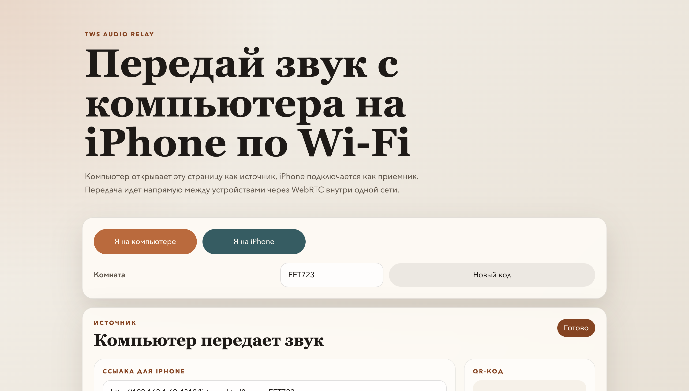
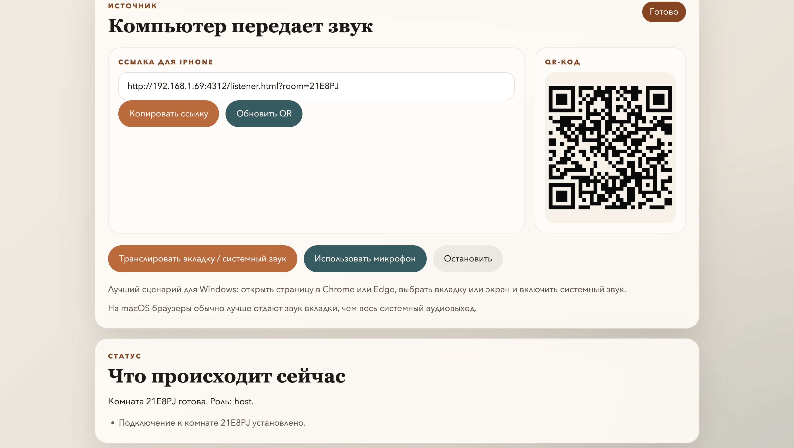
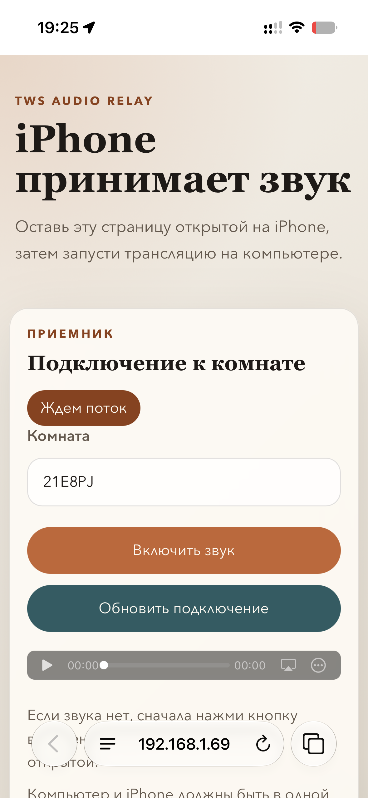

# TWS Audio Relay

Локальный проект для передачи звука с компьютера на iPhone через браузер по одной Wi-Fi сети.

## Скриншоты

### Экран на компьютере





### Экран на iPhone



## Как запустить

```bash
/Users/a1/Projects/tws-audio-relay/start-local.command
```

После запуска открой `http://localhost:4312` на компьютере и отсканируй QR-код с iPhone в той же Wi‑Fi сети.

## Как остановить

```bash
/Users/a1/Projects/tws-audio-relay/stop-local.command
```

## Основные файлы

- `server.mjs` - поднимает локальный Node-сервер, раздаёт страницы и обрабатывает сигнальный обмен для соединения.
- `app.js` - логика страницы на компьютере: создание комнаты, QR-код и запуск трансляции.
- `listener.js` - логика страницы на телефоне: подключение к комнате и воспроизведение входящего аудио.
- `index.html` - основная страница для компьютера.
- `listener.html` - отдельная страница-приёмник для телефона.
- `styles.css` - общие стили интерфейса.
- `start-local.command` - локальный запуск сервера на macOS или Linux.
- `stop-local.command` - локальная остановка сервера на macOS или Linux.
- `runlocalwin.cmd` - локальный запуск сервера из Windows Terminal, `cmd` или PowerShell.
